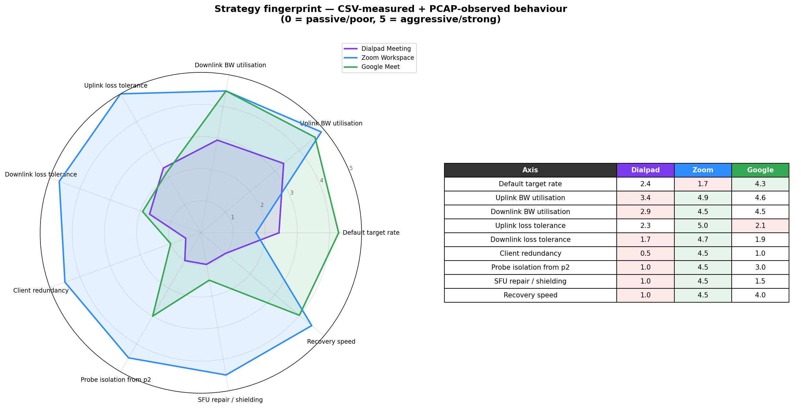
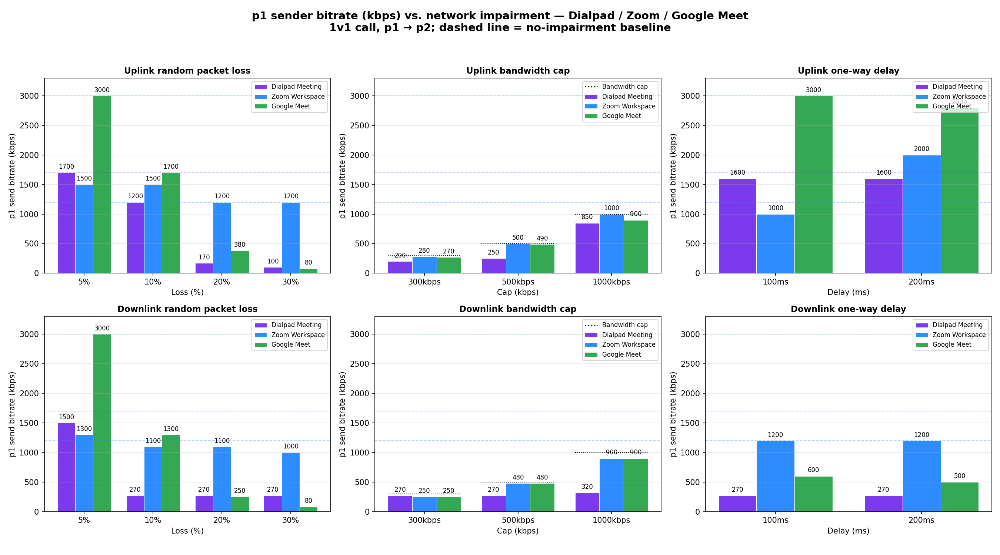
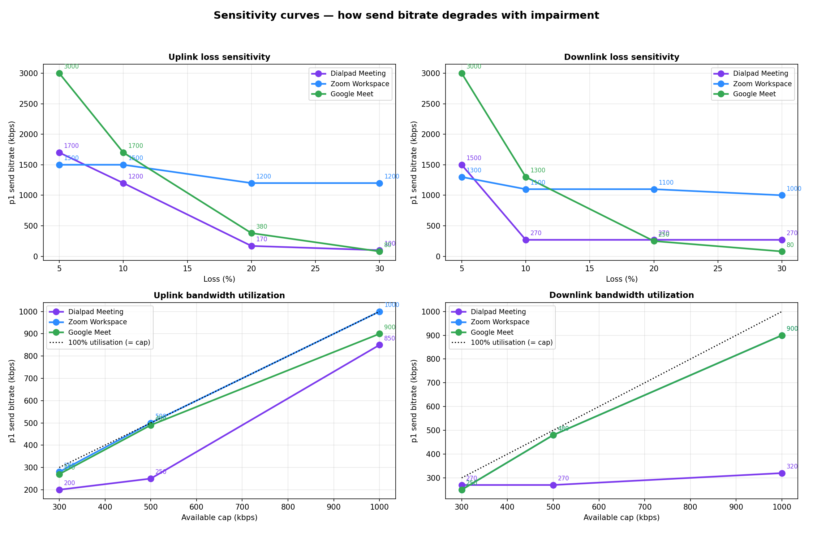
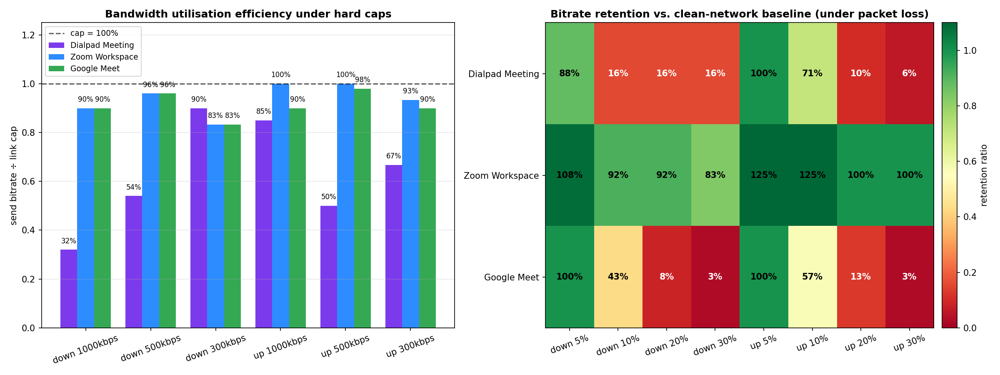
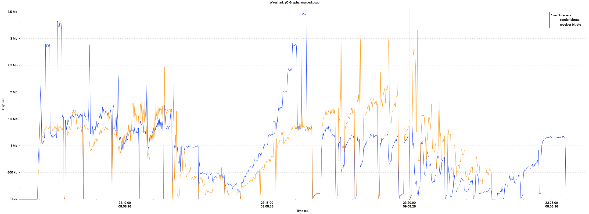
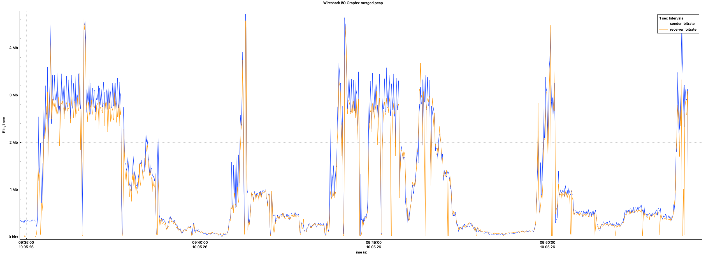
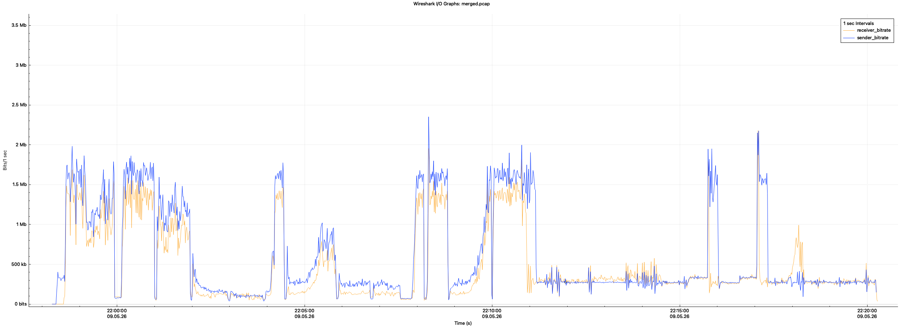

# Dialpad Meeting / Zoom Workspace / Google Meet — Congestion Control Strategy Comparison

> Scope: Under the constraints of this run, these results are meant as a rough, exploratory comparison of how the three stacks behave under adversity—highlighting strategic differences in congestion control, repair, and SFU behaviour—and where to look for improvements, not as a definitive ranking. Impairments were applied with iOS Network Link Conditioner: simple weak-link settings (rate limits, queue depth on the order of ~30 packets, random loss, and fixed delay).

> What a fuller setup would enable: Given professional lab conditions (controlled topology, calibrated shapers, reproducible traces, and automation), the same questions can be pursued with more realistic weak-network models, better variable isolation, higher measurement precision, greater automation, and repeatable benchmarking—including strategy tuning.

---

This repo compares the sender / receiver bitrate behaviour of three video conferencing products under impaired networks, based on a set of 1v1 (`p1 → SFU → p2`) and 1v1v1 (`p1 ──→ SFU ──→ {p2, p3}`) tests. The goal is to surface the differences in bandwidth estimation (BWE), loss resilience, and SFU design, and to derive a prioritized list of improvements for Dialpad.

- **Version**: The latest APP version in May 9, 2026
- **Topology**: `p1 ──→ SFU ──→ p2` and `p1 ──→ SFU ──→ {p2, p3}` All numbers are in **kbps**.
- **Data sources**:
  - `test_result.csv`: steady-state bitrate under each impairment.
  - `dialpad/dialpad_merged.png`, `zoom/zoom_merged.png`, `google/google_merged.png`: full-test Wireshark IO graphs.
    - **Blue line** = p1 sender bitrate
    - **Orange line** = p2 receiver bitrate
    - The gap between them = uplink/downlink loss + packets the SFU absorbs (FEC / RTX / probe / padding).
- **Analysis scripts**: `analyze_bitrate.py`, `strategy_fingerprint.py`. All outputs land in `out/`.

---

## 1. Strategy Fingerprint



A 9-axis radar that summarises everything in one chart

---

## 2. Bitrate Distribution by Impairment



A 2×3 grid: (uplink / downlink) × (loss / bandwidth cap / delay). Each panel shows the three vendors' sender bitrate side by side. Bandwidth-cap panels also draw the link cap as a black dotted line for reference.

Highlights:

- **Uplink 30% loss**: Zoom still 1200 kbps; Dialpad 100 kbps; Google 80 kbps — a huge gap in loss resilience.
- **Any downlink impairment**: Dialpad immediately drops to ~270 kbps and stays there ("safe mode"); Zoom barely moves.
- **Uplink bandwidth cap**: Zoom hugs the link cap (~100% utilisation); Dialpad uses only 250 kbps when capped at 500 kbps (50% utilisation).

---

## 3. Degradation Curves and Bandwidth Utilisation



Four line plots showing how bitrate degrades as impairment intensifies. Bandwidth-cap panels add `y = x` as the "100% utilisation" reference line.

- **Uplink loss** (top-left): Zoom holds 1200–1500 across the whole range. Google and Dialpad both fall off a cliff between 10–20%.
- **Downlink loss** (top-right): Zoom holds 1000–1300; Dialpad drops to 270 and flatlines; Google slides down to 80.
- **Uplink / downlink bandwidth cap** (bottom row): Zoom and Google sit close to 100% utilisation. Dialpad is systematically below the line, and on downlink caps falls as low as 30%.

---

## 4. Quantified "Utilisation" and "Retention"



- **Left**: utilisation = `sent / link cap` under hard bandwidth caps.
- **Right**: retention = `sent / clean-network baseline` under packet loss (red → green; greener is better).

Look at the Dialpad row in the heatmap on the right: downlink loss at 10% / 20% / 30% all give exactly 16% retention. That identical 16% reveals a hard "safe-mode floor" at ~270 kbps — a fixed fallback rate, not a continuous adjustment based on impairment severity.

---

## 5. Full-Test PCAP IO Graphs

### Zoom



- The blue and orange lines maintain a persistent 10–40% gap (blue above) for almost the entire session. This means the client constantly sends FEC/RTX redundancy, and the SFU absorbs it on the first leg, so p2 receives a "cleaned-up" stream.
- The tall narrow blue spikes that shoot up to 3–3.5 Mbps do not appear in the orange line. These are BWE probes sent through the padding/RTX channel, which the SFU does not forward to p2 — bandwidth probing without disturbing the receiver.
- The blue/orange gap is adaptive: in the 23:14–23:16 segment the two lines almost overlap (clean network, less FEC), while 23:18–23:23 shows a much wider gap (more redundancy under stress).

### Google Meet



- Blue and orange almost overlap (except for a few probe spikes). The SFU does near-transparent forwarding: bytes received by p2 ≈ bytes sent by p1.
- The few 4 Mbps blue spikes have matching small bumps on the orange line — those are real video bursts being forwarded, not padding. Google probes via simulcast layer switching + REMB, not by injecting large amounts of padding.
- When loss happens, blue and orange drop together: the SFU has no buffering, no retransmission, no FEC repair. End-to-end loss is fully exposed to p1's GCC, which triggers the classic ~10% loss cliff.

### Dialpad



- Blue and orange also stay closely together — same "transparent forwarder" SFU as Google, so any loss on the first leg propagates to the second leg and back into p1's BWE.
- The long ~250 kbps plateau after 22:13: both blue and orange sit on the floor. This is not "the SFU stopped forwarding" — it is p1 simply not sending more.
- The occasional "blue spike to 1.5–2 Mbps with a small orange bump" inside the plateau is a probe attempt. But because Dialpad has no client-side redundancy and the SFU does not repair, most probe packets are dropped on the impaired downlink, p1 immediately falls back — and never escapes the floor.

---

## 6. Cross-Vendor Differences

### 6.1 Architectural Differences

| Dimension | Zoom | Google Meet | Dialpad |
|---|---|---|---|
| **SFU role** | **Repair node** (consumes FEC/RTX, forwards a clean stream) | Transparent forwarder (at most simulcast layer selection) | Transparent forwarder |
| **End-to-end loss exposed to p1 BWE** | Weak (SFU absorbs some on the first leg) | Strong (loss propagates 1:1 to p1) | Strong |
| **Probe traffic reaches p2?** | No (SFU absorbs padding) | Partially (uses simulcast layers instead of padding) | Partially (probes with real media bitrate) |

Zoom takes the "client sends extra + smart SFU" path. Google and Dialpad take the "simple client + transparent SFU" path.

### 6.2 Control Strategy Differences

| Dimension | Zoom | Google Meet | Dialpad |
|---|---|---|---|
| Default target rate | 1200 kbps (conservative) | 3000 kbps (aggressive) | 1700 kbps (mid) |
| Avg uplink BW utilisation (CSV) | 98% | 93% | 67% |
| Avg downlink BW utilisation (CSV) | 90% | 90% | 59% |
| Client-side FEC / redundancy | Always on, adaptive | Almost never | Almost never |
| Probe pattern | High-frequency padding probes, invisible to p2 | Low-frequency + simulcast switching | Almost none, and uses real media bitrate |
| Receiver-feedback classification | Distinguishes "BW limited" / "loss" / "delay" | Mainly GCC (loss + delay) | "safe mode" |

### 6.3 End-to-End Behaviour

| Dimension | Zoom | Google Meet | Dialpad |
|---|---|---|---|
| Bitrate retention at 30% uplink loss | 100% | 3% | 6% |
| Bitrate retention at 30% downlink loss | 83% | 3% | 16% |
| Recovery under any downlink impairment | Stable | Average | Essentially does not recover |
| Default-rate quality on a clean network | Mid (1.2 Mbps) | High (3 Mbps) | Mid (1.7 Mbps) |
| Effect of one weak-network user on others in a multi-party meeting | None | None | All participants degrade together (see 6.4) |
| Time from "join" to first frame | 1–3 s | 1–3 s | ~5 s, with up to ~5 s of black screen (see 6.5) |

### 6.4 The "One Bad Apple" Effect in Multi-Party Meetings (Dialpad only)

> Observed only on Dialpad, and in multi-party (≥3 people) meetings. Cannot be reproduced in 1v1 tests.

**Scenario**: a 3-person meeting `p1 ──→ SFU ──→ {p2, p3}`, where p2's downlink has loss or is bandwidth-capped, while p3's downlink is clean.

**Observed behaviour**:

- p1's sender bitrate is dragged down to whatever p2 can handle.
- As a result, p3 also receives only this throttled low-quality stream — its quality is sacrificed for no fault of its own.
- One bad apple spoils the whole meeting.

**Likely root cause**:

```
p2 weak link → p2 reports loss → SFU aggregates all receivers' feedback and feeds it back to p1
                                                  ↓
                  p1's BWE picks the "worst receiver" → single stream is throttled → p3 suffers
```

Seems, Dialpad currently follows a "single stream broadcast + worst-receiver-wins" model:

1. Client encodes a single video stream (no simulcast, no SVC layers).
2. SFU forwards the same bitrate to every receiver (cannot differentiate quality per receiver).
3. Sender BWE is driven by the worst feedback (a single weak receiver pulls everyone down).

**Comparison**:

| Vendor | Behaviour with one weak receiver in a multi-party meeting | Why |
|---|---|---|
| **Zoom** | Other participants are unaffected | Client sends multiple simulcast/SVC layers; SFU sends a low layer to the weak receiver and a high layer to everyone else |
| **Google Meet** | Other participants are unaffected | Same idea; standard WebRTC simulcast; SFU selects per-receiver layer |
| **Dialpad** | Everyone's quality drops to the weak receiver's level | Single stream + worst-feedback aggregation |

This is an architectural problem, not something parameter tuning can fix. In production, multi-party meetings are by far the most common case, so the real-world impact is much larger than what the 1v1 tests suggest.

### 6.5 Slow First Frame on Join / Black Screen (Dialpad only)

> A join-experience problem, not directly related to congestion control, but it points to the same gap in SFU capability.

**Observed**:

| Vendor | Click "join" → first rendered frame | Black-screen issue |
|---|---|---|
| Zoom | 1–3 s | Rare |
| Google Meet | 1–3 s | Rare |
| Dialpad | ~5 s | Up to ~5 s of black screen in the worst case |

**Likely root causes**:

1. **SFU does not cache keyframes.**
   A new receiver must wait for the next IDR (I-frame / keyframe) before it can decode anything. If the SFU does not cache the most recent keyframe, the new joiner just waits.
2. **SFU does not actively send PLI / FIR.**
   When a new receiver joins and the SFU has nothing cached, the right thing is to immediately send a PLI (Picture Loss Indication) or FIR (Full Intra Request) to the sender, forcing it to encode a fresh keyframe right away. If this is missing or delayed, the new joiner has to wait until the sender naturally emits the next IDR according to its GOP cycle.
3. **GOP is too long.**
   Even with the two fixes above, if the sender's GOP is long (say > 5 s) and a new joiner happens to just miss a keyframe, the wait can still stretch out. Zoom and Google typically use GOP ≤ 2–3 s combined with an SFU keyframe cache to push first-frame latency down to ~1 s.

These three issues together match the observed "~5 s join + worst-case ~5 s black screen" pattern.

Combining this with earlier findings: Dialpad's current SFU is essentially a "bare RTP forwarder" — no keyframe cache (→ slow join), no FEC/NACK repair (→ worst downlink behaviour), no simulcast layer selection (→ multi-party participants drag each other down). Every P0 item below shares the same prerequisite: **an SFU capability upgrade**.

### 6.6 One-Liner Summary

- **Zoom**: conservative default rate + strong FEC/RTX + smart SFU repair + active padding probes + simulcast layers. Resilience first, experience above all.
- **Google Meet**: aggressive default rate + classic WebRTC GCC + transparent SFU + simulcast layers. Best on a clean network, falls off a cliff under loss, but multi-party participants do not drag each other down.
- **Dialpad**: mid default rate + weakened GCC + bare RTP forwarder SFU + single safe-mode floor + single-stream broadcast. Captures the upside of neither approach: worst on downlink, dragged down by weak users in multi-party calls, and 5 s to even see the first frame.

---

## 7. Recommended Improvements for Dialpad

To close the gap with Zoom on downlink resilience, client and server must be changed together. Tweaking the client BWE alone can only fix the "stuck on the floor" problem.

### P0 — Must Do (Eliminate the "Worst-of-Three" Problems)

#### P0-1. Make the SFU Stop Being Transparent — Upgrade It Into a "Repair Node"

**Problem**: today, any loss on either leg (p1 → SFU or SFU → p2) is passed straight to p2, which then drags down p1's BWE.

**Changes**:
- After receiving FEC/RTX from p1, the SFU should repair locally and forward a clean stream to p2.
- The SFU should cache the last N RTP packets and respond to p2's NACKs itself, instead of always going back to p1 for retransmission.
- When p2 reports loss, first try one round of FEC/RTX repair at the SFU, and only feed the report back to p1 if repair fails.

#### P0-2. Always-On Adaptive FEC on the Client

**Problem**: the data shows 10% uplink loss already drops bitrate from 1700 → 1200, and 20% drops it to 170. The client has no redundancy to absorb the loss.

**Changes**:
- Turn on 5–10% FEC redundancy by default.
- Adapt the redundancy ratio dynamically based on the receiver's reported loss rate.
- Pair with P0-1: the FEC the client emits is consumed by the SFU and not forwarded to p2, so no downlink bandwidth is wasted.

#### P0-3. Periodic Padding Probes, Decoupled from Media Bitrate

**Problem**: the data shows that during the long ~250 kbps plateau, Dialpad never tries to probe upward. The few "blue spikes" inside the plateau are probes done with real media bitrate, so "the more it probes, the more it loses → BWE goes down further".

**Changes**:
- Even in safe mode, send padding probes on a fixed schedule.
- Probes should travel through the RTX/padding channel, and the SFU should not forward them to the other peer.
- When probes show that more bandwidth is available, proactively raise the target rate instead of passively waiting for the media bitrate to climb.

#### P0-4. Classify Receiver Feedback; Retire the One-Size-Fits-All Safe Mode

**Problem**: the data shows Dialpad lands on ~270 kbps in every downlink-impaired scenario (5/10/20/30% loss, 500/300 kbps caps). This is a single state machine falling back to one fixed rate, ignoring the actual symptom.

**Changes**:
- Split receiver feedback into three categories: bandwidth-limited, loss/congestion, and delay growth.
- Each category should trigger a different reaction — for example, loss-driven feedback should bump up FEC first; delay-driven feedback should drop the bitrate one step.
- Replace the "floor mode" with a continuous controller so the rate degrades smoothly with the severity of the impairment.

#### P0-5. Add Simulcast / SVC + Per-Receiver Adaptation in Multi-Party Calls (Fixes the "One Bad Apple" Problem)

**Problem**: see section 6.4. With Dialpad's "single stream + worst-feedback aggregation" model, a single weak-network user in a multi-party meeting drags everyone's quality down. This is one of the most visible production issues, with the largest user impact.

**Changes**:

1. **Enable simulcast or SVC layered encoding on the client.**
   - Recommend simulcast with three layers (720p / 540p / 180p) as a first step.
   - Long-term, evolve to SVC (VP9-SVC, AV1-SVC) where layer dropping is cheaper because layers share a single encoder.

2. **Change the SFU to select and forward layers per receiver.**
   - Maintain a per-receiver bandwidth estimate (based on each receiver's RTCP feedback).
   - Each receiver independently picks the highest layer it can sustain, with no cross-impact.
   - Downlink loss / cap feedback only affects that receiver's layer choice; it is not fed back to the sender.

3. **Change the sender BWE aggregation policy from "worst-wins" to "best-served".**
   - Sender's target rate = the total uplink bitrate needed to serve at least the best-capable receiver with its preferred layer (i.e. the sum of all enabled layers' bitrates).
   - The weakest receiver only decides which layer the SFU sends to it; it does not decide which layers the client encodes.
   - A weak receiver's loss is repaired at the SFU and never reaches the sender's BWE.

#### P0-6. Faster First Frame on Join — Keyframe Cache + Active PLI/FIR + GOP Tuning

**Problem**: Dialpad takes ~5 s to render the first frame after join, with up to ~5 s of black screen in the worst case. Zoom and Google are at 1–3 s. This is a "first impression" metric and very visible to users.

**Changes**:

1. **Add a keyframe cache at the SFU** (the most recent N keyframes plus the dependent P-frames up to the next keyframe).
   - When a new receiver joins, the SFU immediately sends the most recent IDR from the cache, no need to wait for the next keyframe.
   - This change alone brings join latency from "GOP / 2" down to a few hundred milliseconds.
   - Memory cost is modest: caching 1–2 keyframes plus their P-frames per stream is enough.

2. **Send PLI immediately when the SFU cache misses.**
   - When a new receiver joins and the SFU has no usable cached keyframe, actively send a PLI (RTCP Feedback) to the sender.
   - Add deduplication and rate limiting: multiple new joiners within a short window should trigger only one PLI, otherwise the sender keeps emitting forced IDRs and the bitrate becomes jittery.
   - The same path also helps simulcast layer switching and recovery from heavy loss.

3. **Cap the client GOP at ~2 s by default.**
   - Recommend 2s as the default.
   - Under loss, allow the SFU to trigger extra keyframes via PLI — no need to rely on a fixed GOP alone.

### P1 — Should Do

#### P1-1. Make Uplink BW Probing Ramp Up More Aggressively

**Problem**: at a 1000 kbps uplink cap Dialpad sends only 850 kbps (85%); at 500 kbps it sends only 250 kbps (50%). Under the same conditions Zoom is close to 100%.

**Changes**: Shorten the BWE ramp-up time constant and increase the probe step size.

**Expected gain**: uplink utilisation under hard caps moves from 67% → 95%.

---

## 8. Reproduce / Further Analysis

```bash
# Set up environment
python3 -m venv .venv && source .venv/bin/activate
pip install pandas matplotlib numpy

# Generate charts 01 / 02 / 03 from the CSV
python3 analyze_bitrate.py

# Generate chart 04 (strategy fingerprint radar)
python3 strategy_fingerprint.py
```

Outputs:

| File | Content |
|---|---|
| `out/01_panels_by_impairment.png` | 6-panel grouped bar chart (uplink / downlink × loss / cap / delay) |
| `out/02_sensitivity_curves.png` | 4 degradation curves (loss sensitivity + cap utilisation) |
| `out/03_efficiency_and_retention.png` | Cap-utilisation bar chart + loss-retention heatmap |
| `out/04_strategy_fingerprint.png` | 9-axis strategy fingerprint radar |

---

## 9. Weak-network test cases

The steady-state numbers and charts are driven by the `Network condition` column in `test_result.csv`. Labels use a short prefix: `up` = impairment on the path from p1 toward the media server (uplink from p1’s perspective); `down` = impairment on the path from the media server toward p2 (downlink to p2). Under Network Link Conditioner these map to random packet loss (`%`), bandwidth caps (`kbps`), or fixed one-way delay (`ms`).

| CSV label | Impairment |
|---|---|
| `None` | Baseline — no impairment |
| `up5%` / `up10%` / `up20%` / `up30%` | Uplink random packet loss (5–30%) |
| `down5%` / `down10%` / `down20%` / `down30%` | Downlink random packet loss (5–30%) |
| `up1000kbps` / `up500kbps` / `up300kbps` | Uplink bandwidth cap (1000 / 500 / 300 kbps) |
| `down1000kbps` / `down500kbps` / `down300kbps` | Downlink bandwidth cap (1000 / 500 / 300 kbps) |
| `up100ms` / `up200ms` | Uplink added one-way delay (100 / 200 ms) |
| `down100ms` / `down200ms` | Downlink added one-way delay (100 / 200 ms) |

That is 1 baseline row plus 18 impaired conditions (4 + 4 loss, 3 + 3 cap, 2 + 2 delay).

---

## 10. PCAP downloads

Full-session capture files used for the IO graphs in this repo (`dialpad_meeting.pcap`, `google_meet.pcap`, `zoom_workspace.pcap`) are available here:

[PCAPs — Google Drive](https://drive.google.com/drive/folders/1swZrcjwim9Ac016OL-T-2uIP7N1RgEeM?usp=sharing)
